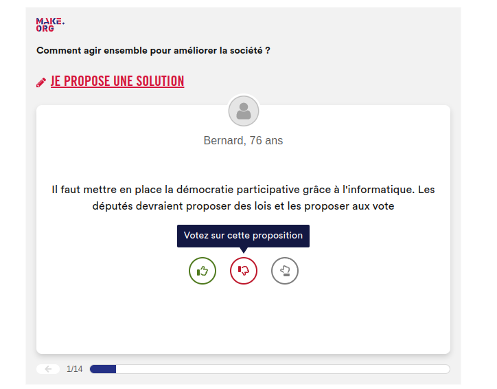

# Make.org widget

The make.org widget lets you deport participation in a consultation to a site other than Make.org.
Integration on the target site is performed using an iframe.

The iframe code that will be integrated is transmitted by Make.org.

***The widget code is specific to the target site***.

The widget cannot be embedded in an email.

## Intégration example

```html
<!doctype html>
<html lang="en">
<head>
  <meta charset="utf-8">
  <title>Example page</title>
  <body>
    <div>
        <!-- Start Widget integration -->
        <iframe frameborder="0" scrolling="no" referrerpolicy="no-referrer-when-downgrade" width="100%" height="550" style="display: block; max-width: 635px; margin: 0 auto; min-height: 550px" src="https://widget.make.org/?questionSlug=demo-make&amp;source=demo-make&amp;country=FR&amp;language=fr&ampwidgetId=5489a6fb-fa5c-4bfa-b973-b42cba07720e&amp;hash=MjAyMy0xMi0xOVQxNDo1MzowOC42NTRa-ea7d61c029b7c2267da6b19745697bfc9cb122c834130822e493b11086199a8857751f691da03597a1e6aac5a19cfa3d3a4012dd58c82cbe05cf954f814492d6"></iframe>
        <!-- End Widget integration -->
    </div>
  </body>
</head>
<body>  
```

***Notes:***

* any modification of the transmitted code may cause malfunction or display problems.
* Ensure that your security definitions allow the usage of the make.org iframe.

```http
# Example of security headers to allow the iframe.

X-Frame-Options: ALLOW-FROM https://widget.make.org
Access-Control-Allow-Origin: https://widget.make.org
```

## Testing

1. Check rendering (mobile and desktop)
2. Try voting
3. Try submiting a proposal (with authentication)



## Cookies

The widget is *cookie less*.

## Authentication

Widget Authentication is based on the Oauth2 protocol with a token transmitted in the Authorization header.

## Troubleshooting

### CORS

Ensure that your security definitions allows the usage of the make.org iframe.

### Using a content manager

Some content managers may alter the iframe code for security reasons.
Check your content manager documentation to ensure that the iframe code is not transformed.
